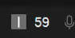

# Simple Virtual Desktop Indicator for Windows 10/11
This is a very simple script written in 10 minutes that shows actively as icon tray which on virtual desktop you are.

## Installation
1. Download the repo
2. Run terminal in repo's folder and install requirements:
    - pip install -r requirements.txt
3. Then run the script:
    - python svdi.py

